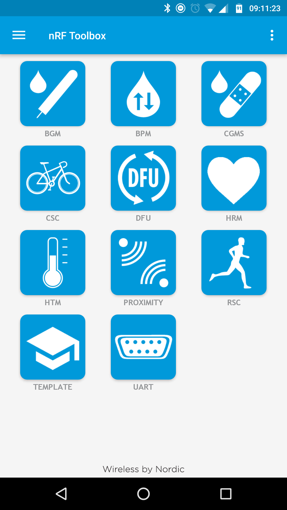
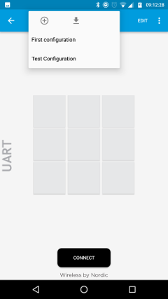
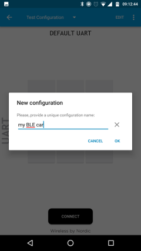
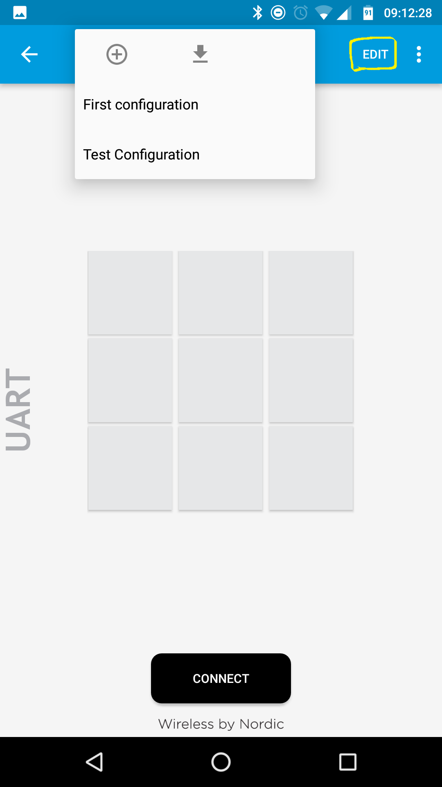
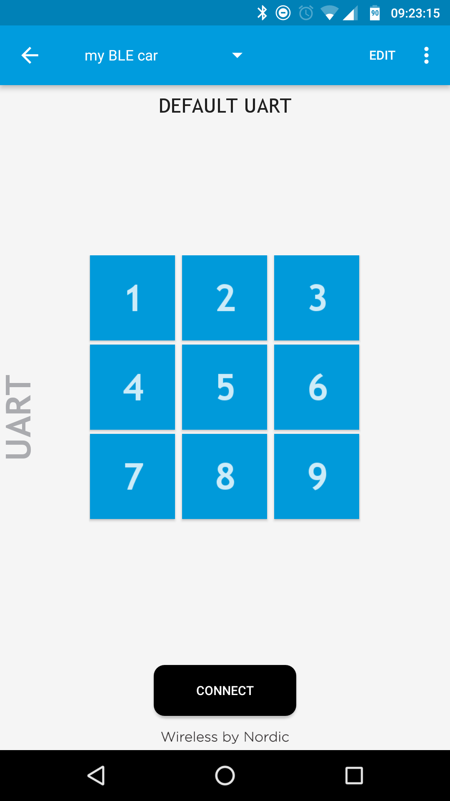

# Initialization of the working environment
 
## Installing Arduino IDE

Install the Genuino 101 board drivers in the Arduino IDE, and test the Blink example
If you don't know what am I talking about, [here is a link for the arduino tutorial page](https://www.arduino.cc/en/Guide/Arduino101#toc2)

## Initialization of the phone (BLE part)

1. Install nrf toolbox [android](https://play.google.com/store/apps/details?id=no.nordicsemi.android.nrftoolbox&hl=en) [iphone](https://itunes.apple.com/us/app/nrf-toolbox/id820906058?mt=8)

1. Open the application

1. Press the UART button

1. Turn on bluetooth
1. Make a new configuration  

1. Give it a nice name. I choose the name "my BLE car"  
1. Press edit, on the top right. The screen should turn to orange.  

1. Press the top left orange button, and enter 1. Choose EOL of LF, and make sure that the Active box hax V. Select any icon you will remember, I chose icon of number 1.  

1. Do the same for all buttons. And press the Done button.  

1. Upload the Sketch called BLE_test.ino to the arduino.