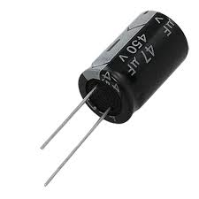
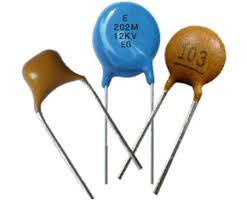

# Making the car go

## Circuit diagram

Let's go over the connections diagram:

](./pictures/section1_schematic.jpg)

1. Battries pack

1. Motors

1. H-bridge, controls the motors. [For more info](https://en.wikipedia.org/wiki/H_bridge)

1. Main switch

1. Arduino / Genuino 101. The part the we program

If you can read this diagram, and you understand how to connect everything, [you can move on to the code!](#code)

## Connect everything

If you are very scared, and can't understand how everything has to be connected, fear not! Follow this instructions:

1. First, we connect everything to a common ground. We connect the negative side of the batteries (black wire) to the middle terminal of the H-bridge. Also, we connect the middle terminal to the negative wire of the arduino (black wire)

1. Now, we connect the motors to the side terminals of the H-bridge.

1. After we connected the motors, we connect the arduino to the input pins in like this: Pin 8 to In1, Pin 9 to In2 etc. Important: Make sure that all jumpers (small black plastic connectors are in the H-bridge)

1. Last but not least, connect the red wire of the batteries to one side of the switch, and the other side to the __left__ terminal of the H-bridge (+12V). Also, connect the left side to the other wire on the arduino

Done with wires, let's go over the code:

## Code

[Link to the base code](./code%20no1/code%20no1.ino)
Upload the code to the arduino, and then send 1 using the application on your phone (That was installed in Secion0)

Let's say that the front is the side that Arduino sits on. If the car goes forward, you are good to go and implement the other directions. If it turns to either side, switch the wires of the motors on the H-bridge. If it goes backwards, switch both wires of both motors.

## Troubleshooting

My car randomly stops!
Most likely, that when you switch directions the motors consume a lot of current, which makes the voltage drop, and forces the arduino into reset. Try adding a big capacitor (1000μF, make sure it is rated for atleast 16V!)  

If it still doesn't work, try adding a small capacitor in parallel to the big capacitor (10nF)  

It t still doesn't work, added capacitors in paraller to the H-bridge motor connections (as shown in the picture TODO)